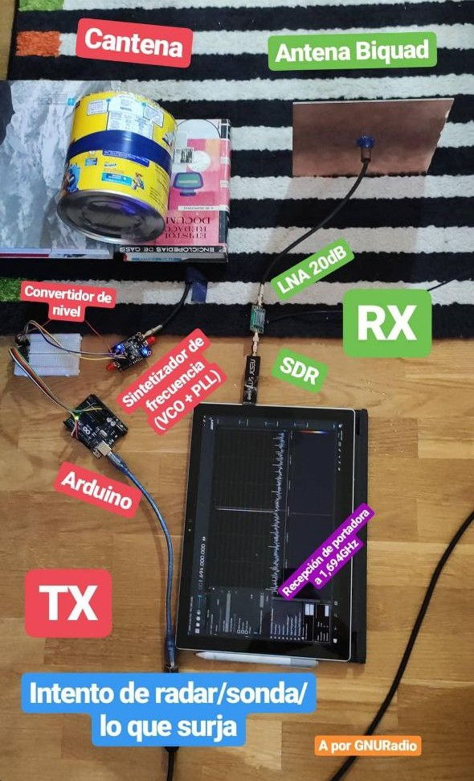
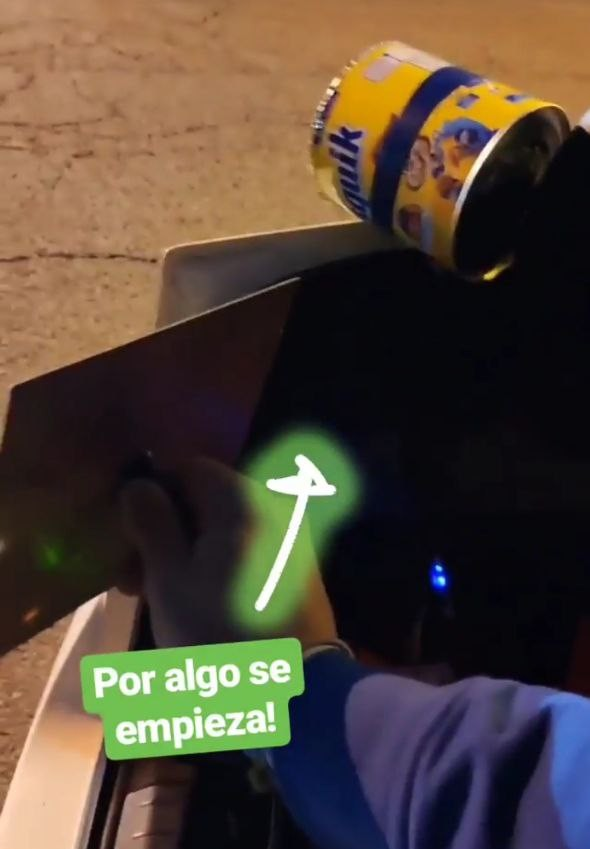

I has always been fascinated by Doppler-effect radars: from their principle of operation to all of the different applications they have, they look like something quite interesting to me. It is for this reason that I decided to try to design my own Deoppler Radar this weekend, which ended up being a great success! All the necessary code and scripts can be found in my [GitHub](https://github.com/pepassaco/HomemadeRadars).

## Hardware

The main difference between the hardware used in this project with respect to all of the previous ones, is that here we will need not only to receive but to transmit a signal. Besides, since I did not have any type of diplexer and I did not want to damage my SDR by inputing a powerful signal to it, I was forced to use thwo antennae. We can see by directly looking into the correspondence between the doppler frequency, the transmitted frequency and the speed of the objet that the higher the transmitted frequency, the higher (easier to identify and to get more resolution) the doppler frequency:

$$f_d \approx 2v\frac{f_{TX}}{c}$$

I did not want to build two new antennae for this small proof-of-concept, so I ended up using the ones I already had that worked at a higher frequency: a cantenna and a biquad for 1,7GHz (designed for LRIT reception). Using such a low frequency can derive in low precision of difficulty to distinguish any doppler frequency. However, it is still theoretically possible to achieve some results with this setup, so I decided to continue anyways.

Once we have decided the frequency at which our radar is going to work, we have to set up both the receiver and the transmitter. 


On the receiver side, I used a cheap SDR that works up to 1,7GHz, connected to a LNA at its input.. On the transmitter side, I went for ADF4351 frequency synthetiser, capable of generating frequencies up to around 4GHz. Since I had one more SPF5189 LNA laying around and these devices have a maximum input power of 1dB before saturation, I lowered a bit (to -1dB) the output power of the synthetiser and connected the LNA in an attempt to have a power amplifier.



Summarising, this is the complete bill of materials I used:

  - ADF4351 Frequency synthetiser
  - 2x SPF5189 LNA
  - Cheap SDR
  - Some coax cable
  - 2x Antennae at the desired frequency
  
## Software

Here is where the fun part starts. The most difficult aspect here is choosing some fundamental parameters such as the sampling frequency, the size of the DFT window, the downsampling factor... We will conver each of these parameters individually.

The first step is declaring all of the necessarry variables, vectors and other parameters that will be needed during the signal processing:

```python=
clear, clc
 
fport = 1693995313;  % Carrier frequency
fcos = 7075;  % Demodulation frequency
FrameLength = 8*4096;  % DFT Window size
fs = 250e3;  % Sampling frequency
Ts = 1/fs;
numRep = 3000;  % Number of iterations
fc1 = 2000;  % First FIR filter cutoff freq
fc2 = fcos;  % Second FIR filter cutoff freq
Mdiez = 32;  % Downsampling factor

t = (0:FrameLength-1)*Ts;  % time vector
f = (0:FrameLength-1)*(fs/FrameLength); % frequency vector (0 to fs) 
y = zeros(FrameLength,1); % FFT of the input
c = cos(2*pi*fcos*t);  % Demodulating signal
fshift = (-FrameLength/2:FrameLength/2-1)*(fs/FrameLength); % frequency vector from -fs/2 to fs/2
fDiez = (0:FrameLength/Mdiez-1)*(fs/FrameLength); % frequency vector after downsampling
fDiezShift = (-FrameLength/(2*Mdiez):FrameLength/(2*Mdiez)-1)*(fs/FrameLength);

mx = zeros(1,numRep); % Vector for saving the resulting doppler frequencies
```
The, we will define our SDR input.

```python=
sdrrx = comm.SDRRTLReceiver('0','CenterFrequency',fport,'TunerGain',0,'SampleRate',fs, ...
    'SamplesPerFrame',FrameLength,'EnableTunerAGC',true,'OutputDataType','double');
```

Afterwards, we create the necessary FIR filters depending on the previously chosen cutoff frequencies:

```python=
m1 = double(f < fc1); 
b1 = fir2(100,f/max(f),m1); 
a1 = 1;

m2 = double(fDiez < fc2);                                                      
b2 = fir2(20,fDiez/max(fDiez),m2);
a2 = 1;
```
Once we have finished the initialitation process, we enter the loop of *numRep* iterations where the signal is to be processed and the doppler frequency obtained. 

Basically, the procedure to follow in each iteration is based on: 

  1. Obtaing the new data and (remove its DC component)
  2. Converting the frequency of the signal by multiplying the received data by a cosenoid
  3. Filter the resultant signal to remove unwanted spurs
  4. Downsample the signal to increase spectral resolution
  5. Apply a second (narrower) filter to the remaining signal
  6. Extract the Doppler component
  
```python=

 for count = 1 : numRep
        data = sdrrx();      % Step 1     
        data = data - mean(data);                                           
         
%         plot(t, real(data));
%         figure
%         plot(t, imag(data));
        
        dataDemod = data.*c';  % Step 2       
        dataFir = filter(b1,a1,dataDemod);  % Step 3
        dataDiez = decimate(dataFir,Mdiez,5);  % Step 4    
        dataDiezFir = filter(b2,a2,dataDiez);  % Step 5

        % DFT
         
        y = abs(fftshift(fft(data)));
        y2 = abs(fftshift(fft(dataDemod)));
        y3 = abs(fftshift(fft(dataFir)));
        y4 = abs(fftshift(fft(dataDiez)));
        y5 = abs(fftshift(fft(dataDiezFir)));
         
    
        plot(fshift, 20*log10(y), fshift, 20*log10(y2), fshift, 20*log10(y3));
	axis([-fs/(5*2) fs/(5*2) -40 60]);

        %plot(fDiezShift,real(20*log(y5)));
        %axis([-fs/(2*Mdiez) fs/(2*Mdiez) -130 100]);

        title('Magnitud de la FFT');
        xlabel('Frequency (Hz)');
        ylabel('magnitude');
        drawnow
        
        
        [M,I] = max(y4);   % Step 5
        if(count > 50)
            I/FrameLength*fs/125
        end
        mx(1,count)=I/FrameLength*fs;
             
    end
```

## Conclusion

It was pretty easy to make a simple radar with just a frequency synthetiser/function generator and a cheap SDR. And it worked great!



Nevertheless, there are some points to improve in this design:

  - Both the frequency synthetiser and the SDR use a different reference clock. This causes a little discrepancy of the carrier frequency between the TX and the RX. While it could be asily solved by taking the reference signal of the SDR and inputing it into the ADF4351 ref port, I did not see convenient opening up and modding the only SDR I have.
  - There is little spectral resolution. This results in having less exactitude when deciding the velocity of the moving target
  - It does not provide any information about the distance to the object. In order to solve this issue, some advance technique such as a pulsated radar or FMCW could be used. I do not dismiss continuing this project in a near future!
  
check the full code at my [GitHub](https://github.com/pepassaco/HomemadeRadars)!
  

  


