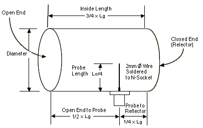

For some time, I have been studying the possibility of receiving images from GOES-16 (a GEO meteorological satellite from the United States located at 75,2W) from my QTH. However, the elevation of the satellite here is pretty low: just about 8º. Then, if I want to get any reasonably good results, I must optimise my receiving setup in terms of both sensibility and noise figure, so that I can receive the LRIT signal withou errors.

The first step here was building an antenna. Since we are working with a GEO satellite at relatively high frequencies, our best bet here is going for a parabolic dish. However, we need a feed at the focus of the parabola. If you read some of my older posts, you will know that, a year ago, I built a Biquad antenna for this purpose. Now, we will build a cantenna and, If I ever manage to receive the satellite, I will compare the performance between the two.

## The antenna

A cantenna is nothing but a waveguide that is open on one side and closed on the other one. In order to feed this waveguide, a simple $\frac{\lambda}{4}$ probe is used.

Through a waveguide, there can be more than one mode of propagation at the same time: there can be some TE, TM and TEM modes. Nevertheless, in the circular type of waveguide we will be using, no TEM mode can exist, so we will just have to analyse both TE and TM.

We want only one mode to be propagated throught the waveguide, in order to avoid some interferece related problems that can be caused if there are multiple modes ath the same time. Then, we will take the one that has the lower cutoff frequency (the lower frequency at which it can propagate). In our case, this will be the TE11 mode. Recall that, due to the symmetric shape of the waveguide, the mode will be $\frac{\lambda}{4}$ high by $\frac{\lambda}{4}$ height, resulting in the 11 sufix. 

The next mode to be propagated would be the TM01 mode. As stated early, we do not want this to happen, so we will need to choose a diameter for the waveguide above the cutoff frequency of the TE11 mode and under the TM01 cutoff frequency. 

There are multiple ways to make these calcultations. You can use Matlab or, if you just want a quick and easy solution, you can find some websites such as [this one](https://www.changpuak.ch/electronics/cantenna.php) or [this other one](http://www.wikarekare.org/Antenna/WaveguideCan.html) which provide the necessary information.

Regarding the connection between the coax and the waveguide, we will use a monopole-type feed (a $\frac{\lambda}{4}$ probe) separed a specific distance both from the closed and to the open end.
